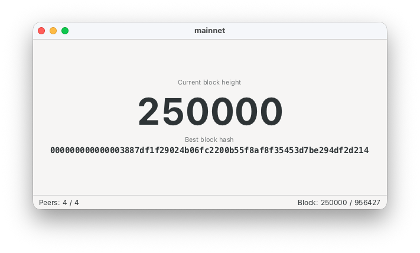

= GChainWatcher

A sample/experimental https://www.gtk.org[Gtk4] application built using https://bitcoinj.org[bitcoinj] and https://java-gi.org[Java-GI], that connects to peers on the https://bitcoin.org/[Bitcoin] network (using a bitcoinj https://bitcoinj.org/javadoc/0.17.1/org/bitcoinj/core/PeerGroup.html[PeerGroup]) to monitor the current block height and "best" block hash.

One thing that makes it experimental is the use of a JavaFX model object (https://github.com/msgilligan/gchain-watcher/blob/master/src/main/java/org/bitcoinj/jfx/model/NetworkModel.java[NetworkModel]) to provide JavaFX https://openjfx.io/javadoc/26/javafx.base/javafx/beans/value/ObservableValue.html[ObservableValue]s that provide updates from the https://github.com/msgilligan/gchain-watcher/blob/master/src/main/java/org/bitcoinj/jfx/model/PeerNetwork.java[PeerNetwork] service to the GTK UI widgets. This adds a dependency on the `javafx.base` module (which contains no native code.) This should allow services and models to be written that can be used in both JavaFX and GTK4 apps (and possibly elsewhere.) The https://github.com/msgilligan/gchain-watcher/blob/master/src/main/java/org/bitcoinj/fxgtk/FxGtkBinding.java[FxGtkBinding] class handles the conversion.

== To build and run:

The https://nixos.org[Nix] https://wiki.nixos.org/wiki/Flakes[flake] takes care of loading all needed native libraries, Gradle, etc. so the build currently requires Nix.

. `nix develop`
. `gradle run`

This should build and run on both macOS and Linux.

